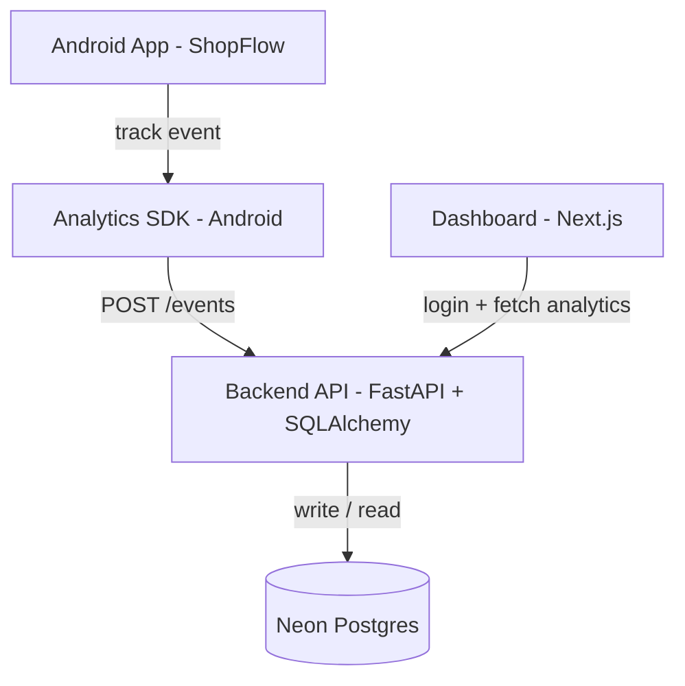
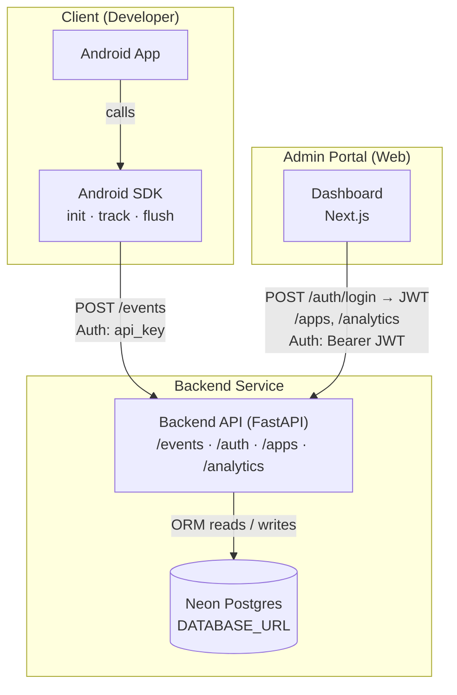

# Architecture

This page explains how the project’s parts work together: **Android SDK → Backend API → Cloud DB → Dashboard**.

## System overview

### Components

- **Android SDK** (`sdk/android/analytics-sdk/`)
  - Developer-facing API: `init()`, `track()`, `flush()`, session helpers
  - Batches events and sends them to the backend
- **Backend API** (`backend/`)
  - FastAPI service with REST endpoints for event ingestion and analytics
  - Stores events and related data in the database
- **Database** (Neon serverless Postgres via `DATABASE_URL`)
  - Stores users, apps, events, funnel definitions, and insights
- **Dashboard** (`dashboard/`)
  - Next.js admin portal
  - Email/password login against the backend (`/auth/*`)
  - Calls backend endpoints to manage apps and fetch analytics/insights

### Data flow (high level)

#### Diagram



## Architecture diagram (Mermaid)

This diagram focuses on **components**, **responsibilities**, and the two auth paths (**api_key** vs **login JWT**).

#### Diagram




## Key ideas and responsibilities

### Event ingestion is “write-only”

Client apps **send** raw events to the backend. The platform is designed so that:

- SDKs only need one core endpoint: `POST /events`
- The dashboard can show analytics without exposing raw event payloads publicly

### Apps and API keys

Each tracked product/app has an **API key** generated by the backend. The API key is used by the SDK to associate events with the correct app/project.

Typical flow:

1. User signs into the dashboard (`POST /auth/login`).
2. User creates an “App” in the dashboard.
3. Backend generates an `api_key` (e.g. `app_xxxxxxxx`) for that App.
4. Developer copies that `api_key` into their Android app and initializes the SDK.

### Authentication model (important)

There are two different “auth concepts” in the system:

- **SDK ingestion auth**: uses **`api_key`** (sent inside the event batch body).
  - This is intentionally simple for client integration.
  - It should be treated as a secret (do not hardcode it into public repos).
- **Dashboard / app management auth**: uses **JWT Bearer tokens issued by the backend**.
  - The dashboard registers/logs in via `/auth/register` or `/auth/login` and stores the returned token.
  - Passwords are hashed with scrypt; tokens are HS256-signed with `JWT_SECRET` and expire after 7 days.
  - It calls protected backend endpoints (like `/apps`) with `Authorization: Bearer <token>`.
  - Backend verifies the JWT and extracts `user_id`, then enforces ownership.

## Backend modules (how the code is structured)

- **Routers**: `backend/app/api/`
  - `events.py`: ingestion endpoint(s)
  - `analytics.py`: analytics + insights endpoints
  - `funnels.py`: funnel definition endpoints
  - `apps.py`: app CRUD (JWT-protected)
- **DB**: `backend/app/db/`
  - `database.py`: engine/session (`DATABASE_URL`)
  - `models.py`: SQLAlchemy tables (apps, events, funnel_definitions, insights)
- **Storage layer**: `backend/app/storage/`
  - Small functions that encapsulate DB reads/writes for specific tables
- **Analytics layer**: `backend/app/analytics/`
  - Funnel calculation, drop-off, path analysis, time-to-complete
- **Insights**: `backend/app/insights/`
  - Snapshot building + LLM prompt construction + insight generation

## Android SDK internals (what happens when you call `track`)

Typical sequence:

1. App calls `AnalyticsSDK.track("event_name", properties)`
2. SDK creates an `AnalyticsEvent` object with:
   - `event_name`
   - `timestamp_ms`
   - `session_id`
   - `platform = "android"`
   - `properties`
3. SDK pushes the event into an in-memory queue
4. SDK flushes immediately (or when threshold is reached)
5. On flush, SDK sends a JSON batch payload:

```json
{
  "api_key": "app_XXXXXXXX",
  "sent_at_ms": 1735368000999,
  "events": [
    {
      "event_name": "app_open",
      "timestamp_ms": 1735368000123,
      "session_id": "a4d9b8c2-7a1c-4d90-b92e-8c12f9a7d301",
      "platform": "android",
      "properties": { "source": "direct" }
    }
  ]
}
```

## Privacy & data handling

This project uses **anonymous session tracking**:

- Events are meant to contain **no PII** (no emails, names, phone numbers, etc.).
- Sessions are anonymous (random `session_id`).
- The “source of truth” for event shape and privacy rules is documented in:
  - `sdk-spec/` (and later mirrored into `docs/android-sdk/event-schema.md`)

## Deployment overview

The repository is structured for:

- **Backend**: deployed to Vercel as a Python function (project root: `backend/`)
- **Dashboard**: deployed to Vercel (project root: `dashboard/`)
- **Database**: Neon Postgres configured via `DATABASE_URL`

